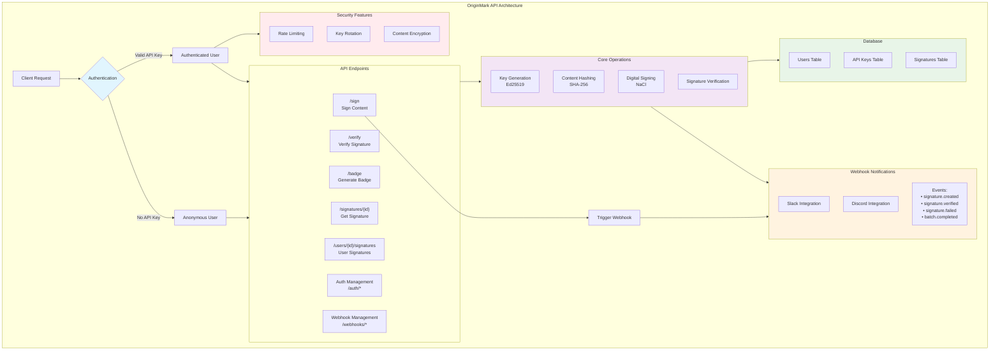

# OriginMark API Architecture

## Description
This diagram shows the complete FastAPI backend architecture including authentication, core endpoints, business logic, database schema, webhook system, and security features. 