# Browser Extension Flow

```mermaid
graph TB
    subgraph "Browser Extension Flow (Manifest V3)"
        PageLoad["Page Load"] --> ContentScript["Content Script Injection<br/>run_at: document_idle"]
        
        ContentScript --> AutoDetect{Auto-Detection<br/>Enabled?}
        AutoDetect -->|Yes| ScanPage["Scan Page for<br/>OriginMark Signatures"]
        AutoDetect -->|No| WaitUser["Wait for User Action"]
        
        ScanPage --> FindSigs{Signatures<br/>Found?}
        FindSigs -->|Yes| CreateBadges["Create Verification Badges"]
        FindSigs -->|No| NoAction["No Action"]
        
        CreateBadges --> InlineBadge["Inline Badge Display"]
        
        subgraph InlineBadge["Badge Features"]
            HoverTooltip["Hover Tooltip<br/>Quick Info"]
            ClickModal["Click for<br/>Detailed Modal"]
            LoadingState["Loading States"]
            ErrorState["Error Handling"]
        end
        
        UserClick["User Clicks Badge"] --> VerifyAPI["API Verification Call"]
        VerifyAPI --> UpdateBadge["Update Badge Status"]
        
        subgraph Popup["Extension Popup (ES Modules)"]
            Settings["Settings Panel"]
            ManualVerify["Manual Verification"]
            APIConfig["API Configuration"]
            NotifPrefs["Notification Preferences<br/>• Auto-detect<br/>• Auto-verify<br/>• Silent mode"]
        end
        
        ExtensionIcon["Extension Icon Click"] --> Popup
        
        subgraph Background["Service Worker (MV3)"]
            ContextMenu["Context Menu Handler"]
            TabMonitor["Tab Update Monitor"]
            NotifManager["Notification Manager"]
            APIManager["API Communication<br/>async/await"]
        end
        
        subgraph ModernJS["Modern JavaScript (ES2022+)"]
            AsyncAwait["Async/Await Throughout"]
            OptionalChaining["Optional Chaining (?.)"]
            NullishCoalescing["Nullish Coalescing (??)"]
            PromiseAPI["Promise-based Chrome APIs"]
        end
        
        Background --> ModernJS
        
        ContentScript --> Background
        Popup --> Background
        
        subgraph Notifications["Notification System"]
            SilentNotif["Silent Notifications"]
            SummaryNotif["Summary Notifications"]
            DetectionNotif["Detection Alerts"]
            VerifyNotif["Verification Results"]
        end
        
        Background --> Notifications
        
        subgraph Storage["Extension Storage"]
            Settings_Store["chrome.storage.sync<br/>Settings"]
            Cache["Verification Cache"]
            Analytics["Usage Analytics"]
        end
        
        Background --> Storage
        Popup --> Storage
        
        RightClick["Right Click on Text"] --> ContextMenu
        ContextMenu --> VerifySelection["Verify Selected Text"]
        
        subgraph Security["Security Features (MV3)"]
            CSP["Content Security Policy"]
            XSSProtection["XSS Protection<br/>escapeHTML()"]
            ServiceWorker["Service Worker Isolation"]
            WebAccessibleRes["Web Accessible Resources<br/>Explicit Matching"]
        end
        
        Background --> Security
        ContentScript --> Security
        
        subgraph DOMManipulation["Efficient DOM Updates"]
            Debounce["Debounced Scroll Handler"]
            DocumentFragment["DocumentFragment Batching"]
            MutationObserver["MutationObserver<br/>Dynamic Content"]
        end
        
        ScanPage --> DOMManipulation
    end
    
    style ContentScript fill:#e3f2fd
    style Background fill:#f1f8e9
    style Popup fill:#fce4ec
    style Notifications fill:#fff8e1
    style Storage fill:#e8eaf6
    style Security fill:#ffebee
    style ModernJS fill:#f3e5f5
    style DOMManipulation fill:#e8f5e8
```

## Description

This diagram illustrates the modernized Chrome extension's operation flow including:

### Manifest V3 Architecture
- **Service Worker** replaces background pages for better performance
- **Content Security Policy** (CSP) in manifest
- **Web Accessible Resources** with explicit matching patterns
- **ES Modules** for service worker (`"type": "module"`)

### Modern JavaScript (ES2022+)
- **Async/await** throughout (replaces callbacks)
- **Optional chaining** (`?.`) for safe property access
- **Nullish coalescing** (`??`) for default values
- **Promise-based Chrome APIs** for cleaner code

### Security Features
- **XSS Protection** with `escapeHTML()` utility
- **Content Security Policy** enforcement
- **Service Worker isolation**
- **Input validation** before API calls

### Performance Optimizations
- **Debounced** scroll and resize handlers
- **DocumentFragment** for batch DOM updates
- **MutationObserver** for dynamic content detection
- **Efficient caching** of verification results

### Features
- Minimum Chrome version: 116
- Full MV3 compliance