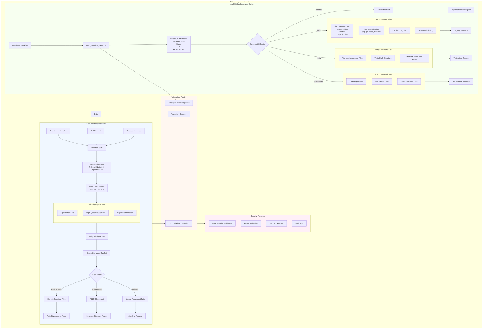

# GitHub Integration Scripts

## Description
This diagram details both automated GitHub Actions workflows and local Git integration scripts, showing how OriginMark integrates with developer workflows for automatic code signing and verification.