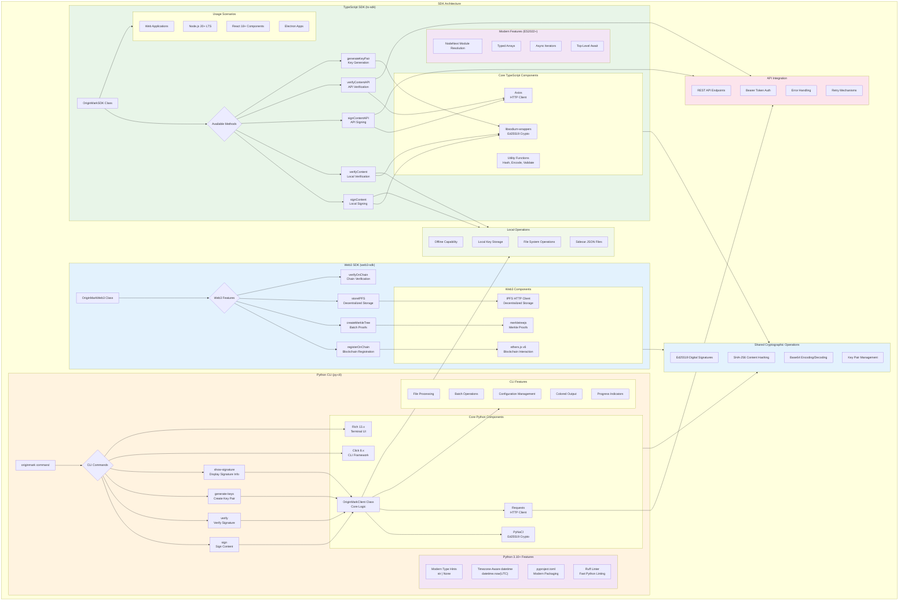

# SDK Architecture

## Description

This diagram shows the modernized SDK architecture including:

### TypeScript SDK (ts-sdk)
- **ES2022 Target** with NodeNext module resolution
- **libsodium-wrappers** for Ed25519 cryptography
- **Strict TypeScript** configuration
- Support for Node.js 20+ LTS and React 18+

### Web3 SDK (web3-sdk) v3.0
- **ethers.js v6** for blockchain interaction
- **IPFS HTTP Client** for decentralized storage
- **Merkle Tree** support for batch proofs
- On-chain signature registration and verification

### Python CLI (py-cli)
- **pyproject.toml** modern packaging (replaces setup.py)
- **Python 3.10+** type hints (`str | None` syntax)
- **Timezone-aware datetime** (no more `utcnow()`)
- **Ruff** for fast linting, **mypy** for type checking
- **Rich 13.x** for beautiful terminal output