# Web Dashboard Flow

```mermaid
graph TB
    subgraph "Web Dashboard Flow (Next.js 15)"
        
        UserVisit["User Visits Dashboard"] --> LoadApp["Load Next.js 15 App<br/>Turbopack Dev Server"]
        LoadApp --> ModeSelect{Select Mode}
        
        ModeSelect --> SignMode["Sign Content Mode"]
        ModeSelect --> VerifyMode["Verify Content Mode"]
        
        subgraph SignMode["Sign Content Flow"]
            SignSetup["Configure Metadata<br/>Author, AI Model"]
            SignSetup --> BatchToggle{Batch Mode?}
            
            BatchToggle -->|Single File| SingleSign["Single File Upload"]
            BatchToggle -->|Multiple Files| BatchSign["Batch File Upload"]
            
            SingleSign --> DropzoneSingle["react-dropzone<br/>Single File"]
            BatchSign --> DropzoneBatch["react-dropzone<br/>Multiple Files"]
            
            DropzoneSingle --> ProcessSingle["Process Single File"]
            DropzoneBatch --> ProcessBatch["Process Files Sequentially"]
            
            ProcessSingle --> APICallSign["API Call: /sign"]
            ProcessBatch --> APICallBatchSign["Multiple API Calls: /sign"]
            
            APICallSign --> SingleResult["Display Single Result"]
            APICallBatchSign --> BatchResults["Display Batch Results"]
            
            SingleResult --> DownloadSingle["Download Signature JSON"]
            BatchResults --> DownloadAll["Download All Signatures"]
        end
        
        subgraph VerifyMode["Verify Content Flow"]
            VerifyUpload["Upload File to Verify"]
            VerifyUpload --> SidecarCheck{Sidecar JSON?}
            
            SidecarCheck -->|Yes| UploadSidecar["Upload Sidecar File"]
            SidecarCheck -->|No| AutoDetect["Auto-detect Signature"]
            
            UploadSidecar --> ProcessVerify["Process Verification"]
            AutoDetect --> ProcessVerify
            
            ProcessVerify --> APICallVerify["API Call: /verify"]
            APICallVerify --> VerifyResult["Display Verification Result"]
            
            VerifyResult --> SuccessDisplay["Success: Show Metadata"]
            VerifyResult --> FailureDisplay["Failure: Show Error"]
        end
        
        subgraph UIComponents["UI Components & Features"]
            ResponsiveDesign["Responsive Design<br/>Mobile + Desktop"]
            DragDropZone["Drag & Drop Zone"]
            ProgressIndicators["Progress Indicators"]
            LoadingStates["Loading States"]
            ErrorHandling["Error Handling"]
            ToastNotifications["Sonner Toast<br/>Notifications"]
        end
        
        subgraph AnimationLayer["Animation Layer (Framer Motion)"]
            FadeIn["Fade-in Animations"]
            SlideUp["Slide-up Transitions"]
            ScaleIn["Scale-in Effects"]
            LayoutAnimations["Layout Animations"]
            SpringPhysics["Spring Physics<br/>Tab Switcher"]
        end
        
        UIComponents --> AnimationLayer
        
        subgraph BatchFeatures["Batch Processing Features"]
            ParallelUpload["Sequential File Processing"]
            ProgressTracking["Progress Tracking per File"]
            ResultsTable["Results Summary Table"]
            FilterResults["Filter Success/Failed"]
            BulkDownload["Bulk Download Actions"]
            ClearResults["Clear Results Action"]
        end
        
        ProcessBatch --> BatchFeatures
        
        subgraph VerificationDisplay["Verification Display"]
            MetadataTable["Metadata Display Table"]
            HashDisplay["Content Hash Display"]
            SignatureDetails["Signature Details"]
            TrustIndicators["Trust Score Indicators"]
            CopyToClipboard["Copy Details to Clipboard"]
        end
        
        VerifyResult --> VerificationDisplay
        
        subgraph APIIntegration["API Integration Layer"]
            AxiosClient["Axios HTTP Client"]
            ErrorRetry["Automatic Retry Logic"]
            RequestQueue["Request Queue Management"]
            ResponseCache["Response Caching"]
        end
        
        APICallSign --> APIIntegration
        APICallVerify --> APIIntegration
        APICallBatchSign --> APIIntegration
        
        subgraph StateManagement["State Management"]
            ReactState["React 18 useState Hooks"]
            FileState["File Upload State"]
            ResultsState["Results State Management"]
            UIState["UI State Control"]
        end
        
        LoadApp --> StateManagement
        
        subgraph Styling["Styling & Design System"]
            TailwindCSS["TailwindCSS 3.4<br/>Utility Classes"]
            GlassMorphism["Glassmorphism Cards<br/>Backdrop Blur"]
            GradientText["Gradient Text Effects"]
            GlowEffects["Glow Shadow Effects"]
            ResponsiveGrid["Responsive Grid Layout"]
            DarkMode["Dark Mode Ready"]
            CustomFonts["Google Fonts<br/>Inter + Outfit + JetBrains"]
        end
        
        UIComponents --> Styling
        
        subgraph ModernFonts["Typography Stack"]
            Inter["Inter<br/>Body Text"]
            Outfit["Outfit<br/>Display Headings"]
            JetBrains["JetBrains Mono<br/>Code/Hashes"]
        end
        
        CustomFonts --> ModernFonts
        
        subgraph Icons["Icon System"]
            LucideReact["Lucide React<br/>Modern Icons"]
        end
        
        UIComponents --> Icons
        
        subgraph Features["Advanced Features"]
            FileTypeDetection["File Type Detection"]
            SizeValidation["File Size Validation"]
            FormatSupport["Multiple Format Support<br/>Text, Images, Documents"]
            BrowserCompat["Cross-browser Compatibility"]
        end
        
        DropzoneSingle --> Features
        DropzoneBatch --> Features
        
        subgraph Security["Security Features"]
            ClientSideValidation["Client-side Validation"]
            SecureUpload["Secure File Upload"]
            NoServerStorage["No Server File Storage"]
            LocalProcessing["Local-first Processing"]
            SecurityHeaders["Security Headers<br/>HSTS, CSP, XSS"]
        end
        
        APIIntegration --> Security
    end
    
    style SignMode fill:#e8f5e8
    style VerifyMode fill:#fff3e0
    style UIComponents fill:#e3f2fd
    style AnimationLayer fill:#f3e5f5
    style BatchFeatures fill:#fce4ec
    style VerificationDisplay fill:#f1f8e9
    style APIIntegration fill:#e8eaf6
    style StateManagement fill:#fff8e1
    style Styling fill:#f3e5f5
    style Security fill:#ffebee
    style Icons fill:#e8eaf6
```

## Description

This diagram demonstrates the modernized Next.js 15 web application including:

### Modern Stack
- **Next.js 15** with Turbopack dev server
- **React 18** with hooks-based state management
- **Framer Motion** for smooth animations and transitions
- **Sonner** for modern toast notifications
- **Lucide React** for consistent iconography

### Design System
- **TailwindCSS 3.4** with custom theme
- **Glassmorphism** cards with backdrop blur
- **Gradient text** and glow effects
- **Dark mode** ready with CSS custom properties
- **Google Fonts**: Inter, Outfit, JetBrains Mono

### Features
- Dual-mode interface (sign/verify)
- Batch processing with progress tracking
- Animated tab switcher with spring physics
- Responsive design for mobile and desktop

### Security
- Security headers (HSTS, CSP, X-Frame-Options)
- Client-side validation
- No server-side file storage