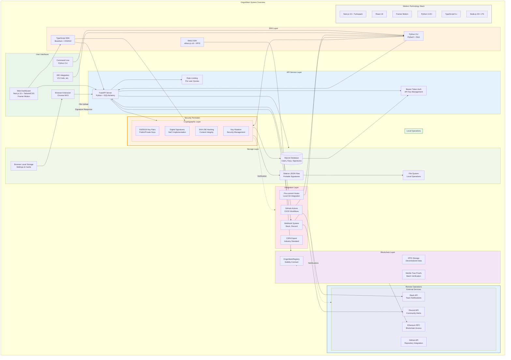

# OriginMark System Overview

## Description

This provides a high-level view of all OriginMark components showing:

### Modern Technology Stack
- **Next.js 15** with Turbopack for web dashboard
- **React 18** with modern hooks
- **Framer Motion** for animations
- **TypeScript 5.x** with strict mode
- **Python 3.10+** with modern type hints
- **Node.js 20+ LTS** runtime

### User Interfaces
- Web Dashboard (Next.js 15 + TailwindCSS)
- Browser Extension (Chrome MV3)
- Command Line (Python CLI)
- IDE Integration

### SDK Layer
- TypeScript SDK (ES2022, libsodium)
- Web3 SDK (ethers.js v6, IPFS)
- Python CLI (PyNaCl, Rich)

### Blockchain Integration
- Smart contract for on-chain registration
- Merkle tree proofs for batch verification
- IPFS for decentralized storage

### Security Features
- Ed25519 digital signatures
- Content hashing (SHA-256)
- Key rotation management
- Rate limiting and authentication